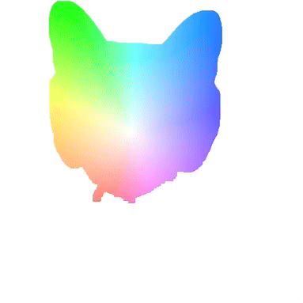

# Flow Web Visualization

Optical flow is often represented using a colormap, with the hue of a color indicating the direction of the flow and the saturation indicating magnitude (with white indicating no motion). For example, the below indicates a rotation of 30 degrees inside the outline of a cat's face, and no movement outside the outline:


This visualization can be hard to understand. If we're displaying flow on the web, we can create a much better visualization by adding a tiny bit of interactivity:



This repo contains a minimum working example of the above interactive visualization, in which an arrow showing the exact displacement of a pixel is drawn when the user hovers over that pixel.

### Getting Started

To run locally, start a webserver (to avoid CORS complaints from browser when loading jsons) with

```
python -m http.server
```

Then navigate to the webserver (probably `http://localhost:8000/`, but check the port number).

### Making JSON files

To make the json file of offsets, see the script in `assets/make_json.py`. To run, the following should work:

```
python make_json.py --flow_path stretches/flow.pth
```

`flow.pth` is a 1×2×H×W pytorch tensor indicating the x and y displacements at each pixel, in units of pixels.

### HTML Stuff
The following html is how you actually get the visualization on the webpage:

```HTML

<canvas class="viz" width="512" height="512" data-json-path="./assets/tilt30/flow.json"></canvas>
```

`data-json-path` is the path to the output of the `assets/make_json.py`.